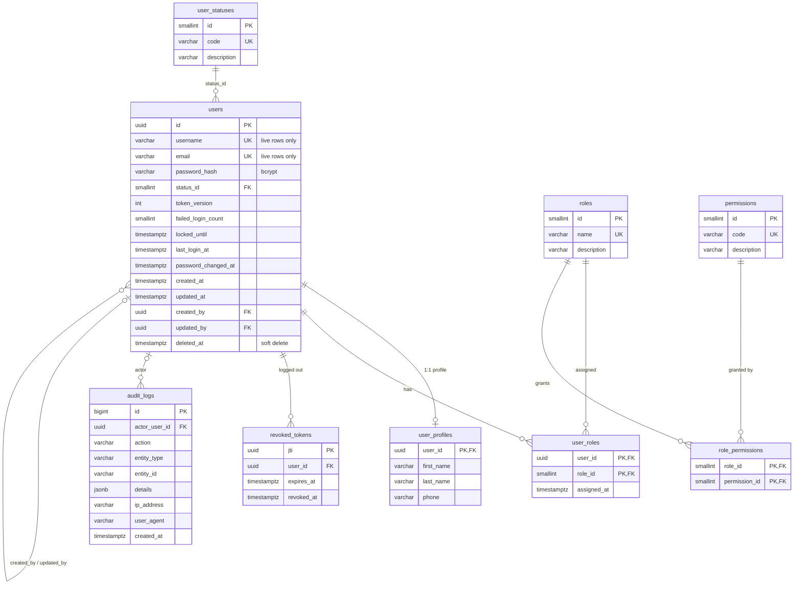

# ER Diagram

Renders in GitHub, GitLab, VS Code (Mermaid extension) and <https://mermaid.live>.

## Normalization (3NF) notes

- **1NF:** every column is atomic. Roles are rows in `user_roles`, not a list in `users`.
- **2NF:** the many-to-many tables (`user_roles`, `role_permissions`) have composite keys and no non-key columns that depend on only part of the key (`assigned_at` depends on the pair).
- **3NF:** no non-key column depends on another non-key column. Status text lives in `user_statuses`, role text in `roles`, permission text in `permissions`; profile attributes sit in `user_profiles`, keyed by the user.
- **Deliberate, documented exceptions to pure normalization:**
  - `audit_logs.entity_id` is a plain string with no FK, because audit rows must outlive and describe any entity type, including deleted ones.
  - `audit_logs.details` is JSONB: an immutable event snapshot, never joined or updated.
  - `users.failed_login_count`, `locked_until`, `token_version` depend only on the user, so they stay in `users`.

## Extending

New permission: insert into `permissions` and `role_permissions`; no code change for data, add the code to a route's `authorize(...)`. New role: insert into `roles`. New user attribute: add to `user_profiles`. New audited entity: write `audit_logs` rows with a new `entity_type`.
